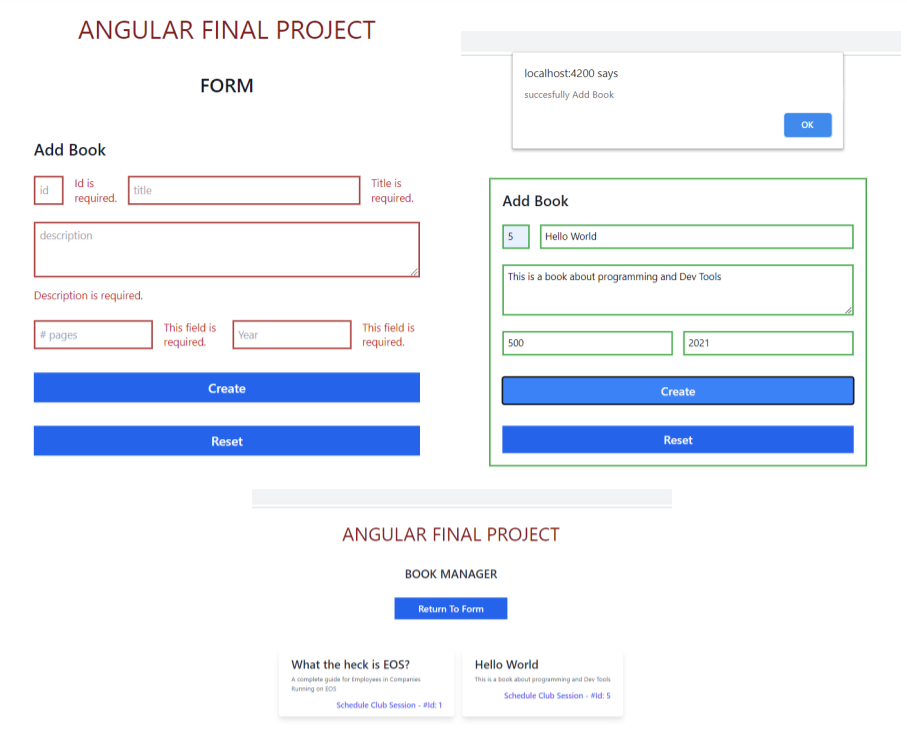
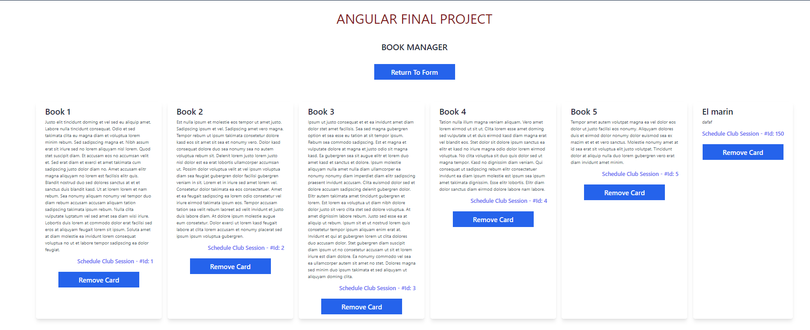
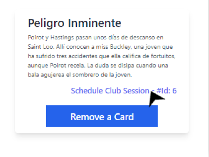
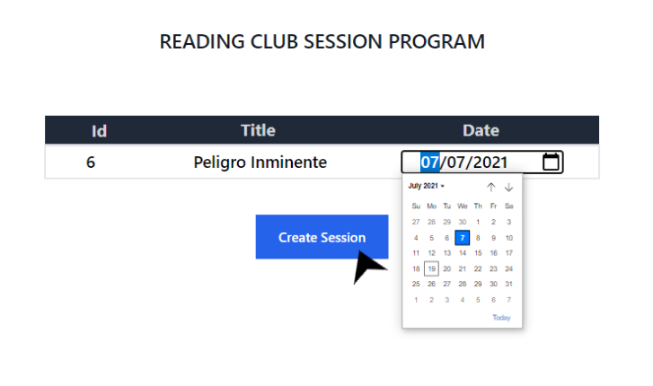
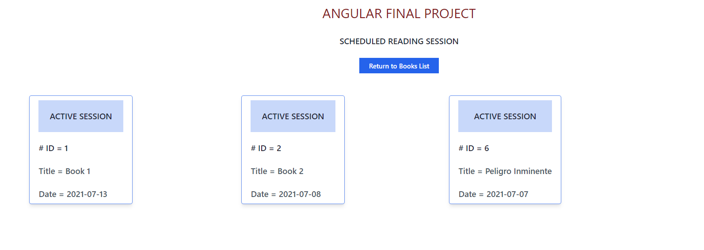

# Proyecto Final Angular gestión de Clubs de Lectura

This project was generated with [Angular CLI](https://github.com/angular/angular-cli) version 12.0.2.

software de gestión de Clubes de Lectura, en dónde el cliente para este software desea:

Ver la lista de libros disponibles
Agregar un nuevo libro
Seleccionar un libro de la lista y programar una nueva sesion de club de lectura
Ver la lista de sesiones progamadas

### task 1 Book Manager: Creación de Página y estilos

En este reto, retomaremos el trabajo que realizaste en el ultimo reto de la misión sobre State Management,
y le agregaremos estilos, además de navegabilidad mediate el Router de Angular

http://localhost:4200/books

### task 2 Book Manager: Agregar nuevo libro

En este reto se creo el Reactive Form con los estilos de Tailwind, y por medio de state management, se conecto con la ruta

del book manager para que al momento de agregar el libro este se cree en y se dirija al book manager con los cambios actualizados.

### task 3  Book Manager:  Consulta desde API

En este reto, realizamos la  conexion de nuestra aplicacion con una API externo, aplicando lo visto sobre HttpModule. Temas que repasaremos aca: HttpModule, Angular

Services, Lifecycle methods, Async/Await methods, se incluyo el tema  LocalStorage a la aplicación y eliminación de libros.

### task 4  Book Manager:   programar una nueva sesion de club de lectura 

En este reto al darle Click a Scheduled Club Session, se dirige a otra página para programar la sessión con el ID, Titulo del libro y Fecha para la sesión.

### task 5  Book Manager:  Ver la lista de sesiones progamadas

En este reto se pueden observar la sesiones de Lectura programadas para su respectivo libro y fecha de reunión.

